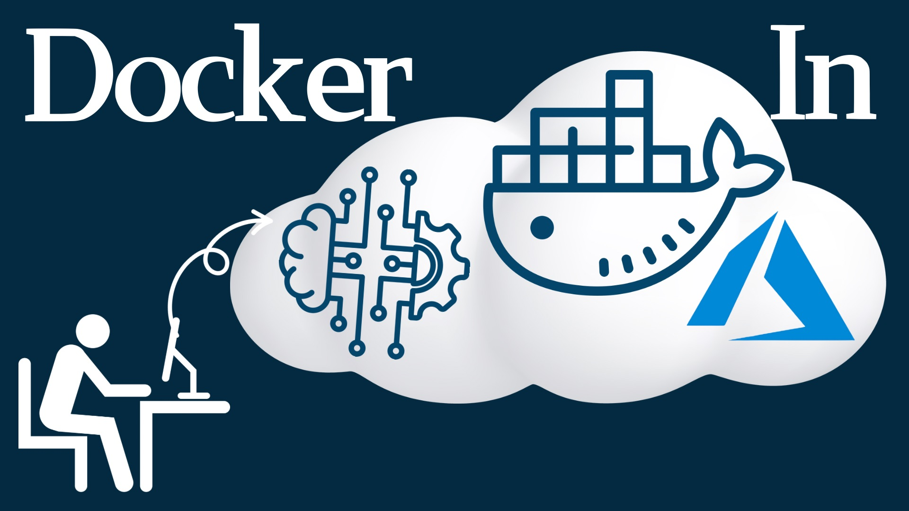

# DevOps & Data Science with Docker and Cloud

Welcome to our course on leveraging Docker for DevOps and Data Science, particularly focusing on infrastructure and machine learning platforms. This course is designed for beginners and includes hands-on practices with Docker to create a cloud-based deep learning analysis environment.

## What You Will Learn

- **Docker Environment Setup**: Learn how to set up a data analysis environment similar to Kaggle using Docker.
- **Cloud Connectivity**: Various methods to connect a powerful cloud computing environment to your local machine.
- **Cost Efficiency**: Techniques to minimize costs while using cloud services.
- **Linux Fundamentals**: Basic Linux commands necessary for understanding Docker.
- **IDE Container Features**: Utilizing container features in IDEs like VSCode, RStudio, and Jupyter Notebook.

### Course Features

- **Practical Docker Projects**: Focus on hands-on Docker projects to synchronize local and Azure cloud environments.
- **Performance Differences**: Observe noticeable performance differences between cloud and local setups.
- **Spot Discount**: Learn how to utilize cloud resources at a fraction of the cost using spot instances.
- **Dynamic Links**: Use dynamic linking to quickly access course materials and updates even after the course ends.

## Tools and Hardware

- **Visual Studio Code** is primarily used.
- **Cloud GPU Settings**: Applied on a Linux virtual machine, accessible from any local environment.
- **Compatibility**: Suitable for Windows, Linux, and MAC users.

## Course Outline

1. **Docker Commands**: Understanding and applying Docker commands using Docker's help feature.
2. **Dev Containers in VSCode**: Learn to set up a Python analysis environment using VSCode's dev container extension.
3. **Docker Image Creation and Deployment**: Practical sessions on creating and managing Docker images.

## After the Course

- Gain confidence in handling Docker-based projects.
- Overcome any intimidation of cloud services or Linux.
- Access high-performance computing resources at a minimal cost.

## FAQ

- **Do I need a GPU in my local setup?** No, a GPU is not required locally as the setups are cloud-based.
- **What OS can I use?** The course is compatible with any operating system.
- **Do I need to know R for this course?** While R is included to strengthen Docker command skills, the focus is on practical Docker usage for data scientists.

## Recommended For

- Data Engineers, Scientists, and Analysts looking to practically learn Docker.
- Developers and Engineers who wish to apply Docker in real-world scenarios.
- Anyone needing a practical portfolio in cloud environments.

We look forward to helping you scale your data science and devops skills using Docker and cloud technologies!
